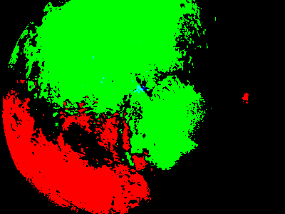

# cvcuda
This repository contains a very simple script to test the opencv + CUDA setup.
If everything is intalled correctly, making should give no errors and the result of the script should look like this:
.
.

# How to make
1.  `mkdir build`
2.  `cd build`
3.  `cmake ..`
4.  `make`
5.  `cd ..`

# Execute script
Here it is important that you are not in the build directory itself, but one level higher. So: in the  `cvcuda` directory, (which you are if you did step 5 from the above steps). Then execute: `./build/a.out`
